# Search API Pantheon version 8.0 (solr 8)

[](https://circleci.com/gh/pantheon-systems/search_api_pantheon/tree/8.x-1.x)

This module is meant to simplify the usage of [Search API](https://www.drupal.org/project/search_api) and [Search API Solr](https://www.drupal.org/project/search_api_solr) on [Pantheon](https://pantheon.io). Search API Solr provides the ability to connect to any Solr server by providing numerous configuration options. This module automatically sets the Solr connection options by extending the plugin from Search API Solr. The module also changes the connection information between Pantheon environments. Doing so eliminates the need to do extra work setting up Solr servers for each environment.




## Composer

Composer is the way you should be managing your drupal module requriements. This module will install it's dependencies when you use composer to install.

## Dependencies (installed by composer):

- [Solarium](http://www.solarium-project.org/). Solarium is a Solr client library for PHP and is not Drupal-specific. First, register Drupal.org as a provider of Composer packages. This command should be run locally from the root directory of your Drupal 8 git repository.

- [Search API](https://www.drupal.org/project/search_api). Search API is Drupal's module for indexing content entities.

- [Search API Solr](https://www.drupal.org/project/search_api_solr). Search API Solr makes search API work with Apache Solr. Composer will manaage which version

- [Guzzle](https://docs.guzzlephp.org/en/stable/). Guzzle version 6 is standard with Drupal Core `8.x | 9.x` (read 8.x OR 9.x).

## Install

To require this module.

```
composer require pantheon-systems/search_api_pantheon ^8 --prefer-dist
```

## Setup instructions

See the [Drupal.org for complete documentation on Search API](https://www.drupal.org/node/1250878). To configure the connection with Pantheon, do the following steps on your Dev environment (or a Multidev):

* **Enable Solr on your Pantheon site**

  * Under "Settings" in your Pantheon site dashboard, enable Solr as an add on.
    This feature is available for sandbox sites as well as paid plans at the
    Professional level and above.

* **Enable the modules**

  * Go to `admin/modules` and enable "Search API Pantheon."

  * Doing so will also enable Search API and Search API Solr if they are not already enabled.

* **OPTIONAL: Disable Drupal Core's search module**

  * If you are using Search API, then you probably will not be using Drupal Core's Search module.

  * Uninstall it to save some confusion in the further configuration steps: `admin/modules/uninstall`.

* **The Search API server**

  * Navigate in the drupal interface to `CONFIG` => `SEARCH & METADATA` => `SEARCH API` => `NEXTGEN PANTHEON SOLR 8`

* **Solr versions and schemas**

  * The version of Solr on Pantheon is Apache Solr 8.8. When you first create
    your index or alter it significantly, you will need to update the SCHEMA
    on the server. Do that either with a drush command or in the administration
    for the Solr Server.

  * Navigate to `CONFIGURATION` => `SEARCH AND METADATA` => `SEARCH API`
    => `PANTHEON NEXT GEN SOLR 8` => `PANTHEON SOLR ADMIN`

  * Choose the button labled "POST SOLR SCHEMA".

  * The module will post a schema specific to your site.

* **Use the server with an index**

  The following steps are not Pantheon-specific. This module only alters the the configuration of Search API servers. To use a server, you next need to create an index.

  * Go to `admin/config/search/search-api/add-index`.

  * Name your index and choose a data source. If this is your
    first time using Search API, start by selecting "Content"
    as a data source. That option will index the articles,
    basic pages, and other node types you have configured.

  * Select "Pantheon" as the server.

  * Save the index.

  * For this index to be useable, you will also need to configure fields to be searched.
    Select the "fields" tab and `CHOOSE FIELDS TO BE INCLUDED IN THE INDEX`. You may want
    to index many fields. "Title" is a good field to start with.

  * After adding fields the configuration, make sure the index is full by clicking
    "Index now" or by running cron.

* **Search the Index**

  * Create a new view returning `INDEX PANTHEON SOLR8` of type 'ALL'. Don't worry right now how it's sorted, we're
    going to change that to 'relevance' once we have some data being returned in the search.

  * In the view, `CHOOSE FIELDS TO BE INCLUDED IN THE RESULTS` from the fields you added to your index
    when you created it. In addition to the fields you added to the index, choose 'relevance' to added
    to the results.

  * Expose any keywords to the user to change and the view will put a KEYWORDS

  * Once your search is returning results, you can now sort by the "relevance" field and solr will give the documents
    a relevance rating. Higher rating means Solr thinks the item is "more relevant" to your search term.

* **Export your changes**

  * It is a best practice in Drupal 8 to export your changes to `yml` files.
    Using Terminus while in SFTP mode, you can run `terminus --env=dev drush "config-export -y"`
    to export the configuration changes you have made. Once committed, these changes
    can be deployed out to Test and Live environments.

### Pantheon environments

Each Pantheon environment (Dev, Test, Live, and Multidevs) has its own Solr server. Indexing and searching in one environment does not impact any other environment.

### Feedback and collaboration

Bug reports, feature requests, and feedback should be posted in [the drupal.org issue queue.](https://www.drupal.org/project/issues/search_api_pantheon?categories=All) For code changes, please submit pull requests against the [GitHub repository](https://github.com/pantheon-systems/search_api_pantheon) rather than posting patches to drupal.org.
