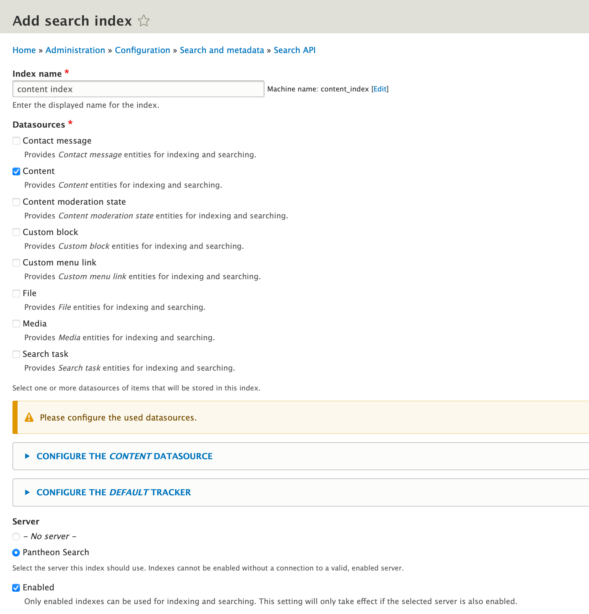
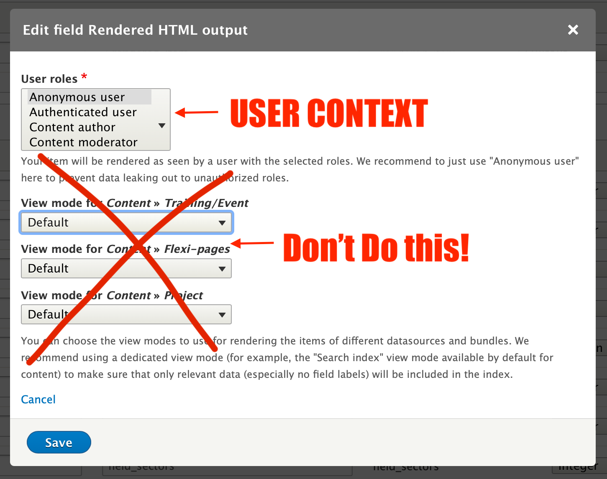
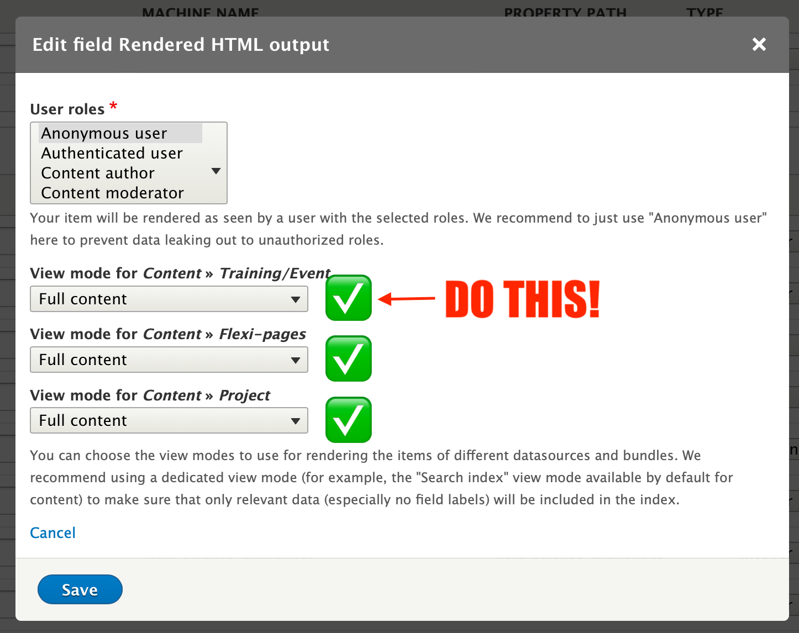
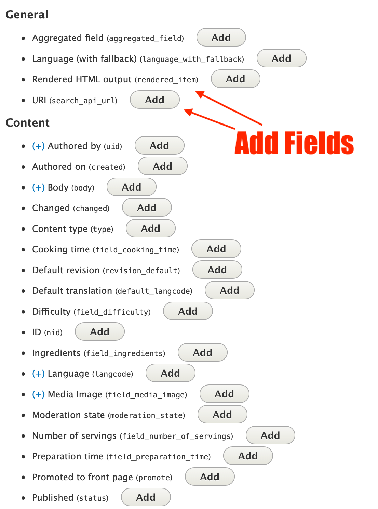
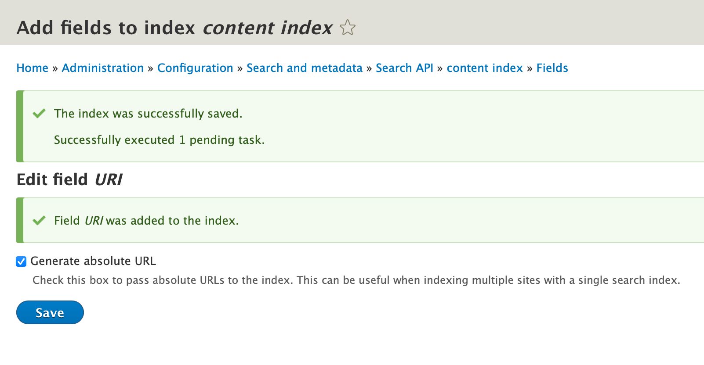
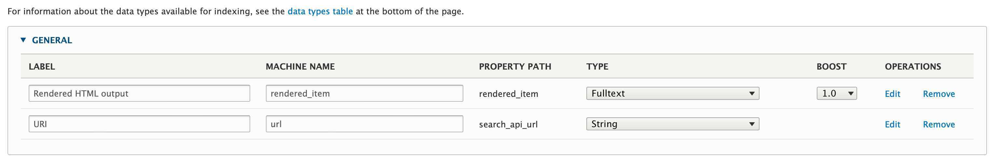
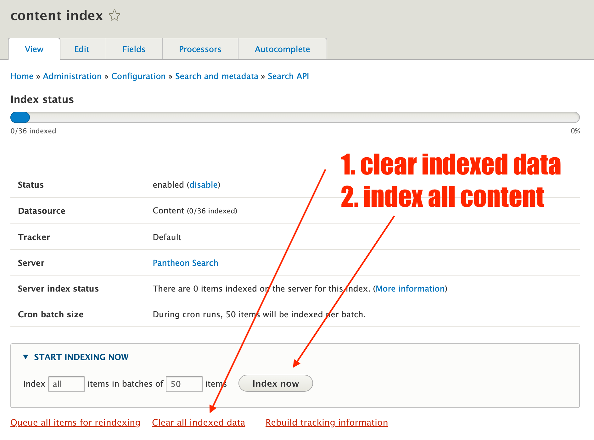
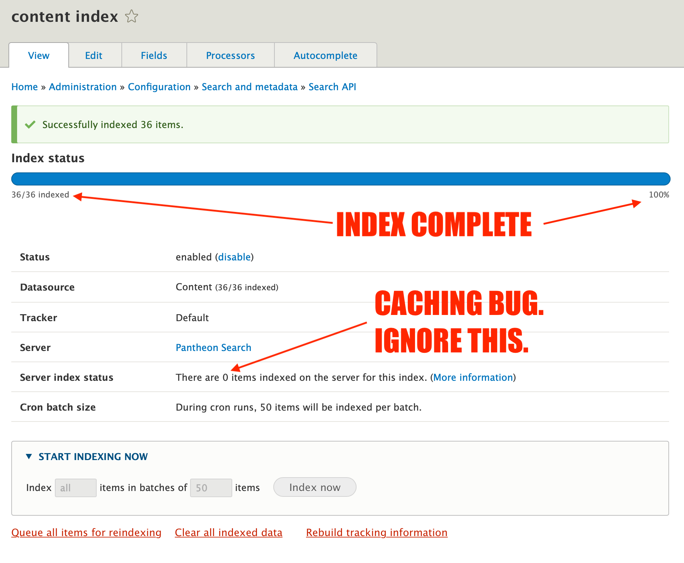
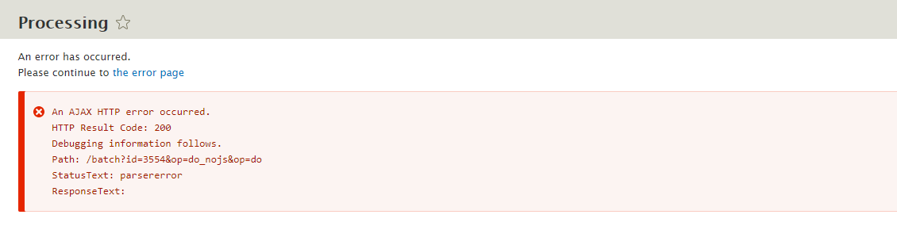

# Troubleshooting Indices

This document answers the question: "I have everything installed and my server says "can be reached" but my index isn't
returning any documents when I search. What do I do?"

Troubleshooting your search_api_pantheon search results:

1. **Verify a server round trip is working correctly.**

   Using terminus run the drush command "search-api-pantheon:diagnose".

   ```bash

   terminus drush {site_name border="2" />.{env border="2" /> -- search-api-pantheon:diagnose

   ```

   This command diagnoses problems with connections and can sniff out where the problem exists by what part of the
   command fails or succeeds. If the command completes without error, the connection to the server is working and you're
   ready to index.

2. **Do you have, or did you create an index?**

   

   In order to return search results, your search server has to have at least one "index". Your index must index content
   from at least one datasource (ideally, "content") and you must choose "pantheon"'s driver as the server for that
   index.

3. **If you have special permissions on your content, make sure the index is created with the correct user context.**

   

   We recommend that your search results index "FULL CONTENT" views of all content types.

   

4. **Once you have established the index, you will need to add fields. We recommend that unless you know what you're
   doing, add the "rendered content" field and the "uri" field.**

   

   

   

5. **Anytime you make a change in the server's fields, you will need to re-send all of your content from the site to the
   Solr index for indexing.**

   

   

6. **Ajax errors when indexing:**

   

   When you choose "index now" what is happening is search_api is going through each of the indexed entities and
   rendering it with your theme. That means, if there are errors or notices in your theme, the indexing process may error
   while rendering the node and you'll get ajax errors like the one here.

   Check the drupal error log for where the error is and resolve the theme errors to resolve issues with the indexing process.

7. **"My View still doesn't pull back any search results"**

   Create a new view from scratch that uses no theming and just does a fulltext search. Then try the search using various users
   searching for multiple words that are known to exist in a node. You can usually figure out what's going wrong with the view
   this way.

