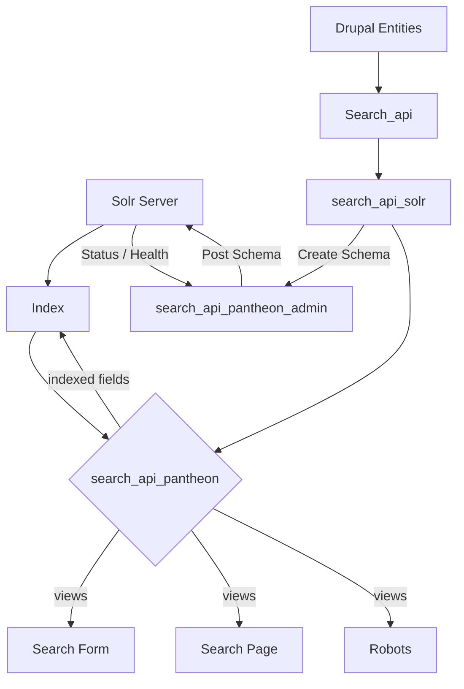

```mermaid
graph TD
  A[Solr Server] -->
  B[Index] --> C{search_api_pantheon}
  C -->|views| D[Search Form]
  C -->|views| E[Search Page]
  C -->|views| F[Robots]
  H --> | Create Schema | G[search_api_pantheon_admin] --> |Post Schema| A
  H[search_api_solr] --> C --> |indexed fields| B
  I[Search_api] --> H
  J[Drupal Entities] --> I
  A --> |Status / Health| G
```
